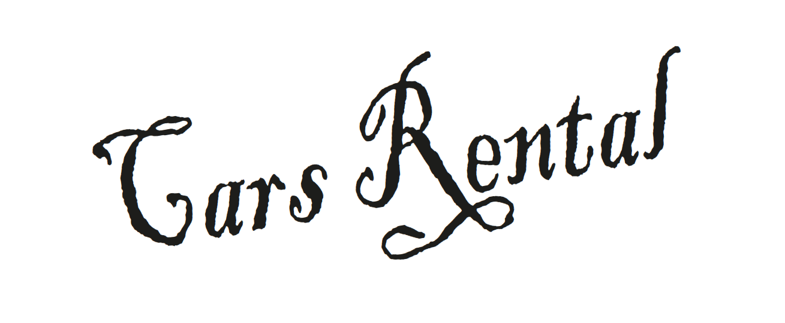
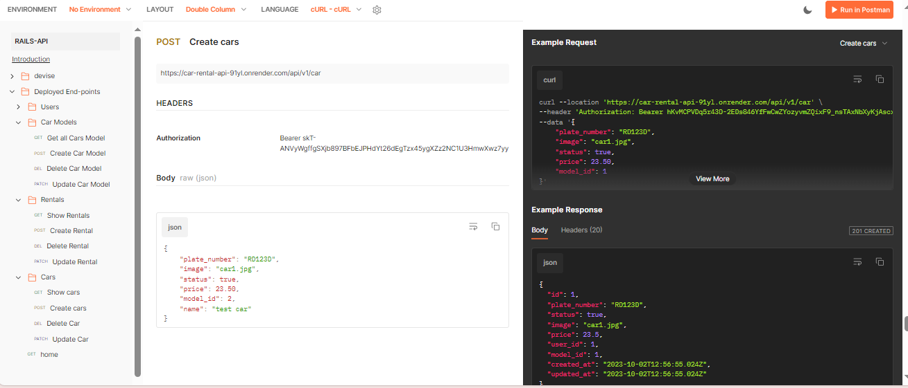
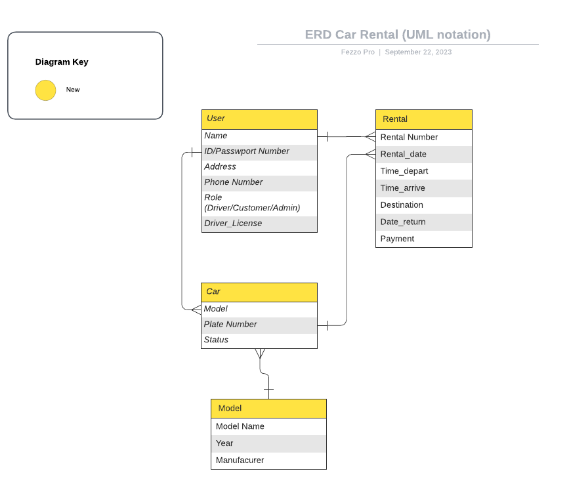

<div align="center">
  <h2><b>🕹️🕹️ Car Rental API 🕹️🕹️</b></h2>
  <br/>
    
  <br/>
</div>

<a name="readme-top"></a>

<!-- TABLE OF CONTENTS -->

# 📗 Table of Contents

- [📖 About the Project](#about-project)
  - [🛠 Built With](#built-with)
    - [Tech Stack](#tech-stack)
    - [Key Features](#key-features)
  - [🚀 Link to Api Docs](#api-docs)
  - [🚀 Link to React Frontend](#front-end)
  - [🚀 Kaban Board](#Kaban-Board)
    - [Kaban Board Initial State](#initial-state)
  - [ERD Diagram](#erd)
- [💻 Getting Started](#getting-started)
  - [Setup](#setup)
  - [Prerequisites](#prerequisites)
  - [Usage](#usage)
- [👥 Authors](#authors)
- [🔭 Future Features](#future-features)
- [🤝 Contributing](#contributing)
- [⭐️ Show your support](#support)
- [🙏 Acknowledgements](#acknowledgements)
- [📝 License](#license)

<!-- PROJECT DESCRIPTION -->

# 📖 [Car-Rental-app-api] <a name="about-project"></a>

**[Car Rental APi]** The backend application is specifically designed to streamline the car rental process by providing users with a seamless experience. It empowers users to effortlessly explore a wide range of available cars, make reservations for their preferred vehicles, and conveniently customize rental details according to their needs.


### Tech Stack <a name="tech-stack"></a>

- <a href="https://www.ruby-lang.org/en/documentation/">Ruby</a>
- <a href="https://rubyonrails.org/">Rails</a>
- <a href="https://www.postgresql.org/">PostgreSQL</a>

<!-- Features -->

### Key Features <a name="key-features"></a>

- **[User Registration and Authentication]**
- **[Cars Listings]**
- **[Booking and Reservation Management]**

<p align="right">(<a href="#readme-top">back to top</a>)</p>

<!-- Link to Api Documentation -->

## 🚀 Link to Api Documentation <a name="api-docs"></a>

To access the documentation, run the rails server using `rails s` and go to the above link

- [Link to api-doc](https://documenter.getpostman.com/view/8148254/2s9YJc1Np7#a9ac381d-7262-4258-8356-ae5a8821455d)

<br/>
    
<br/>


<p align="right">(<a href="#readme-top">back to top</a>)</p>

<!-- Link to frontend -->

## 🚀 Link to Front-end <a name="front-end"></a>

- [Link to Front-end](https://github.com/tumainimaganiko/front-end-capstone-group)

<p align="right">(<a href="#readme-top">back to top</a>)</p>

## 🚀 Kaban Board <a name="Kaban-Board"></a>
- [Kaban Board](https://github.com/users/tumainimaganiko/projects/5) This is the link to the project management tool used to track the progress of the project.

### Kaban Board Initial State <a name="initial-state"></a>
- [Kaban Board Initial State](https://github.com/tumainimaganiko/front-end-capstone-group/issues/17) This is the link to the project management tool used to track the progress of the project.

In this team, we are 4 in number,

- @Racha_Ouldbabaali
- @Tumaini_Maganiko
- @Felix_Kamana
- @Dilsher_Balouch

<p align="right">(<a href="#readme-top">back to top</a>)</p>


## 🚀 ERD Diagram <a name="erd"></a>

<br/>
    
  <br/>


<p align="right">(<a href="#readme-top">back to top</a>)</p>


<!-- GETTING STARTED -->

## 💻 Getting Started <a name="getting-started"></a>

To get a local copy up and running, follow these steps.

### Prerequisites

In order to run this project you need:

1. git
use the following link to setup `git` if you dont have it already installed on your computer
<p align="left">(<a href="https://git-scm.com/book/en/v2/Getting-Started-Installing-Git">install git</a>)</p>

2. Ruby
use the following link to setup `Ruby` if you dont have it already installed on your computer
<p align="left">(<a href="https://www.ruby-lang.org/en/documentation/installation/">install Ruby</a>)</p>

3. Rails
use the following link to setup `Rails` if you dont have it already installed on your computer
<p align="left">(<a href="https://guides.rubyonrails.org/getting_started.html#creating-a-new-rails-project-installing-rails">install Ruby</a>)</p>

4. PostgreSQL
use the following link to setup `PostgreSQL` if you dont have it already installed on your computer
<p align="left">(<a href="https://www.tutorialspoint.com/postgresql/postgresql_environment.htm">install PostgreSQL</a>)</p>

### Setup

Clone this repository to your desired folder:

```sh
  RUN cd my-folder
  RUN git clone https://github.com/DilsherB/backend-final-capstone
  RUN cd backend-final-capstone
```

Env Variables:

```sh
  Create .env file to the app root directory
  Add the following env variables and save

  export HOST=localhost
  export PORT=3001
  export DB_USERNAME=YOUR_DATABSE_USERNAME
  export DB_PASSWORD=YOUR_DATABSE_PASSWORD
  export DB_HOST=localhost
  export DB_PORT=5432
```

Install dependencies:

```sh
  RUN cd backend-final-capstone
  RUN bundle install
```

### Database
Edit `config/database.yml` with your database connection info. Run the following command

```sh
    RUN rails db:create
    RUN rails db:schema:load
    RUN rails db:migrate
```

### Usage

The following command can be used to run the application.

```sh
  RUN rails s
```

### Test

To run spec tests:

```sh
  RUN rspecs
```

<p align="right">(<a href="#readme-top">back to top</a>)</p>

<!-- AUTHORS -->

## 👥 Authors <a name="authors"></a>

👤 **Felix KAMANA**

- GitHub: [@githubhandle](https://github.com/fezzopro)
- LinkedIn: [LinkedIn](https://www.linkedin.com/in/kamana-felix/)

👤 **Racha Ould Babaali**
- GitHub: [@rachaouldbabaali](https://github.com/rachaouldbabaali)
- LinkedIn: [LinkedIn](https://www.linkedin.com/in/rachaouldbabaali/)

👤 **Tumaini Maganiko**

- GitHub: [@githubhandle](https://github.com/tumainimaganiko)
- Twitter: [@twitterhandle](https://twitter.com/Chief2maini)
- LinkedIn: [LinkedIn](https://www.linkedin.com/in/tumainimaganiko/)

👤 **Dilsher Balouch**

- GitHub: [@DilsherB](https://github.com/DilsherB)
- Linkedin: [Dilsher Balouch](https://www.linkedin.com/in/dilsher-balouch/)
- Twitter: [@\_brilliantMindz](https://twitter.com/_brilliantMindz)
  
- 
<!-- FUTURE FEATURES -->

## 🔭 Future Features <a name="future-features"></a>

- [ ] **[Add Admin dashboard]**
- [ ] **[Add payment system]**
- [ ] **[Cancel reservation]**

<p align="right">(<a href="#readme-top">back to top</a>)</p>

<!-- CONTRIBUTING -->

## 🤝 Contributing <a name="contributing"></a>

Contributions, issues, and feature requests are welcome!

Feel free to check the [issues page](../../issues/).

<p align="right">(<a href="#readme-top">back to top</a>)</p>

<!-- SUPPORT -->

## ⭐️ Show your support <a name="support"></a>

If you like this project, please don't forget to follow the contributors and give it a star.

<p align="right">(<a href="#readme-top">back to top</a>)</p>

<!-- ACKNOWLEDGEMENTS -->

## 🙏 Acknowledgments <a name="acknowledgements"></a>

We would like to appreciate [Microverse](https://www.microverse.org/) for providing the resources and the platform for us to be Professional full-stack developers, and We would especially thank   [Murat Korkmaz](https://www.behance.net/muratk) who is the original author of this [design](https://www.behance.net/gallery/26425031/Vespa-Responsive-Redesign)

<p align="right">(<a href="#readme-top">back to top</a>)</p>

<!-- LICENSE -->

## 📝 License <a name="license"></a>

This project is [MIT](./LICENSE) licensed.

<p align="right">(<a href="#readme-top">back to top</a>)</p>
